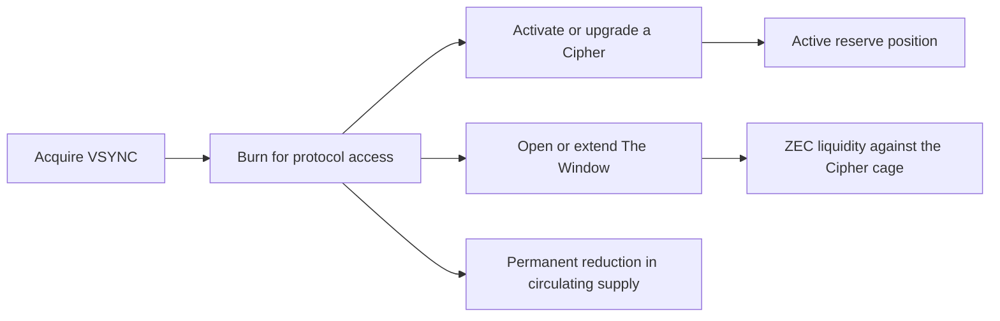

# The Veil Syndicate

> A reserve protocol where `$VSYNC` is burned to activate programmable Ciphers backed by individually accounted ZEC reserves.

## Application Snapshot

| Field | Detail |
|---|---|
| Project | The Veil Syndicate |
| Category | DeFi, token utility, reserve infrastructure, programmable NFTs |
| Intended network | Robinhood Chain |
| Utility token | `$VSYNC` |
| Reserve asset | ZEC |
| NFT supply | 2,100 Ciphers |
| Stage | Concept design and economic validation |
| Team | `0xsbcntrl` |
| Contact | X: [@0xsbcntrl](https://x.com/0xsbcntrl) · Telegram: [@sbcntrl](https://t.me/sbcntrl) |

## One-Sentence Pitch

The Veil Syndicate turns `$VSYNC` into a consumable access key for activating Ciphers, increasing their reserve weight, and opening non-liquidating liquidity windows against their individually accounted ZEC reserves.

## Executive Summary

The Veil Syndicate is a privacy-oriented reserve protocol designed for Robinhood Chain. It connects two assets with distinct responsibilities:

- `$VSYNC` is the access and coordination asset. It is burned when a holder activates, reactivates, upgrades, or opens financial functionality for a Cipher.
- ZEC is the reserve asset. It is separately accounted, transparently reported, and never represented as making public EVM activity private.

The protocol issues a fixed collection of 2,100 Ciphers. Every Cipher begins in a dormant state called **Veiled**. A holder activates it by burning `$VSYNC`, after which the Cipher can receive a weighted share of eligible ZEC distributions. Higher ranks carry more weight but remain subject to hard supply caps.

The core financial primitive is **The Window**. An active Cipher holder burns `$VSYNC` to access an advance against a portion of that Cipher's existing ZEC cage without destroying the NFT. The advance is denominated and collateralized in ZEC, requires no market-price oracle, and cannot trigger a price-based liquidation. Future distributions first reduce the outstanding advance. If the holder permanently redeems the Cipher, the contract deducts the outstanding balance and releases the remaining ZEC.

The result is a token with recurring utility beyond speculative holding: `$VSYNC` grants access to liquidity, rank progression, activation, and reactivation. The system does not require staking emissions or a fixed yield promise.

## The Problem

Most token economies use one of three mechanisms to manufacture demand:

1. inflationary staking rewards;
2. governance rights with limited practical value;
3. rewards funded by later token buyers.

These mechanisms can attract short-term capital, but they often fail to create durable reasons to consume the token. They also make it difficult for users to distinguish genuine utility from reflexive incentives.

At the same time, NFT holders commonly face a binary choice: hold an asset and remain illiquid, or sell it and permanently exit the position. Conventional NFT lending partially addresses this problem but introduces price oracles, liquidation risk, fragmented liquidity, and dependence on external lenders.

The Veil Syndicate addresses both problems by making the token a consumable key to a reserve-native financial position. A Cipher is not only an image or membership credential. It is a programmable record containing rank, reserve accounting, claim history, activation state, and Window obligations.

## The Initial Protocol

### 1. The Veiled State

All 2,100 NFTs begin as **Veiled**.

A Veiled NFT:

- exists as part of the fixed collection;
- has no active reserve weight;
- does not participate in ZEC distributions;
- cannot open a Window;
- can be transferred.

Veiled is the dormant state of a Cipher, not a rank.

### 2. Activation

The holder burns between `50,000–250,000 $VSYNC (TBD)` to activate a Veiled NFT as a rank-01 Cipher.

Activation:

- permanently removes the required `$VSYNC` from circulation;
- creates no staking position and no emissions;
- enables reserve accounting and eligible distributions;
- unlocks access to The Window.

The protocol does not count burned `$VSYNC` as revenue and does not use activation proceeds to pay existing holders.

### 3. Rank System

The proposed rank structure is:

| Rank | Name | Reserve weight | Upgrade cost | Maximum supply |
|---:|---|---:|---:|---:|
| 01 | Cipher | 1x | `50,000–250,000 $VSYNC (TBD)` activation | Open within the 2,100 collection |
| 02 | Nullifier | 2x | TBD | 210 Ciphers |
| 03 | Shadow | 3x | TBD | 105 Ciphers |
| 04 | Syndicate | 5x | TBD | 21 Ciphers |
| 05 | Sovereign | 10x | TBD | TBD |

Rank weight determines a Cipher's relative participation in an eligible distribution pool. It does not represent a fixed interest rate or guaranteed return.

Upgrade requirements, the Sovereign cap, and any cooldowns will be finalized through economic simulation before deployment.

### 4. Transfer and Reactivation

When an active Cipher is transferred, it goes dark and returns to the Veiled state. Its historical state, cage, rank, and disclosed obligations remain attached to it, but it stops participating until the new holder burns `$VSYNC` to reactivate it.

This rule creates recurring token utility while preventing active status from becoming a permanently transferable yield entitlement.

### 5. Redemption

The holder may permanently burn a Cipher to close the position and redeem the ZEC available in its cage, subject to any outstanding Window balance and the published redemption rules.

Redemption is terminal. The burned Cipher cannot return to the collection.

## The Window

### Product Definition

The Window is a reserve advance secured by the Cipher's own accounted ZEC cage.

It allows an active holder to access liquidity without:

- selling the Cipher;
- permanently redeeming it;
- borrowing against the market price of `$VSYNC`;
- relying on an external price oracle;
- facing liquidation caused by market volatility.

### User Flow

1. The holder connects an active Cipher.
2. The protocol shows the Cipher's ZEC cage, current obligations, rank limit, and available Window.
3. The holder selects an amount within the permitted limit.
4. The protocol quotes the required `$VSYNC` burn.
5. The holder burns `$VSYNC` and receives the approved ZEC advance.
6. Future eligible distributions are routed first toward closing the outstanding Window.
7. Once the Window is closed, distributions return to the holder normally.

If the holder chooses permanent redemption before the Window closes, the contract subtracts the outstanding advance from the cage and releases the remaining balance.

### Illustrative Rank Limits

These limits are starting parameters for simulation, not final commitments:

| Rank | Maximum Window as a percentage of accounted cage |
|---|---:|
| Cipher | 10% |
| Nullifier | 20% |
| Shadow | 30% |
| Syndicate | 40% |
| Sovereign | 50% |

The protocol would also enforce a global utilization ceiling. A conservative initial target is no more than 20% of eligible reserve liquidity deployed through open Windows.

### Dynamic Burn Quote

The `$VSYNC` required to open or increase a Window can respond to system utilization:

```text
VSYNC burn quote = base burn x duration factor x utilization multiplier
```

When reserve utilization is low, access is less expensive. As utilization approaches the global ceiling, the required burn rises. When the ceiling is reached, new Windows pause until liquidity returns.

This creates a native risk-control mechanism and demand for `$VSYNC` without issuing rewards.

### Solvency Model

The Window is designed around five constraints:

1. **Same-asset accounting:** the advance and the cage are denominated in ZEC.
2. **No market-price loan:** the credit limit is based on accounted reserve value, not the secondary-market price of the Cipher or `$VSYNC`.
3. **No rehypothecation:** the protocol cannot promise the same ZEC simultaneously to multiple holders.
4. **Advance below cage value:** an open Window cannot exceed its rank-specific fraction of the recorded cage.
5. **Automatic settlement:** future distributions repay the Window first, while redemption nets the obligation against the cage.

From an accounting perspective, an open Window reduces the Cipher's immediately redeemable ZEC. The interface must show gross cage value, outstanding advance, and net redeemable value separately.

### Transfer With an Open Window

The proposed design keeps the obligation attached to the Cipher rather than the wallet:

- the Cipher becomes Veiled on transfer;
- the outstanding Window remains visible on-chain;
- the recipient must explicitly accept the state before purchase or transfer;
- reactivation requires accepting or closing the outstanding obligation;
- future distributions continue to amortize the Window after reactivation.

An alternative implementation may block transfers until the Window is closed. Both approaches will be evaluated for user safety and smart-contract simplicity.

## `$VSYNC` Utility

`$VSYNC` is designed as an access key rather than the reserve asset or reward token.

Its proposed functions are:

| Action | `$VSYNC` behavior |
|---|---|
| Activate a Veiled NFT | Burn |
| Reactivate after transfer | Burn |
| Upgrade a Cipher's rank | Burn |
| Open a Window | Burn |
| Increase or extend a Window | Burn |
| Restore selected privileges after a transfer | Burn, subject to final design |

There is no planned `$VSYNC` staking emission. Holding the token alone does not generate more `$VSYNC` or guarantee access to ZEC.

This creates a simple monetary loop:



## Reserve and Distribution Policy

The ZEC reserve and the `$VSYNC` token supply are accounted separately.

The initial proposal is to accumulate ZEC through a transparent fee policy connected to protocol-native `$VSYNC` market activity and protocol-owned liquidity. Final fee sources, percentages, and reserve-seeding terms remain subject to simulation, legal review, and incubation.

The design follows these principles:

- no fixed APY;
- no guaranteed distribution schedule;
- no distribution funded directly by activation or upgrade burns;
- only realized and verifiable ZEC can enter reserve accounting;
- reserve, operating treasury, and liquidity balances remain separate;
- every Cipher exposes gross cage value, liabilities, and net redemption value;
- distribution windows can pause when coverage or liquidity falls below published thresholds.

The Window does not manufacture yield. It provides early access to ZEC already attributable to a Cipher and uses future eligible distributions to restore that availability.

## Why ZEC

ZEC gives the protocol a reserve asset with a credible history, fixed monetary identity, and a direct association with privacy-preserving payments.

The Veil Syndicate makes a precise distinction:

- Zcash can provide privacy within supported shielded Zcash transactions.
- Robinhood Chain is a public EVM environment.
- The protocol will not claim that holding ZEC or using a Cipher automatically makes public EVM activity private.

This distinction is part of the product's credibility and disclosure policy.

## Why Robinhood Chain

The intended deployment on Robinhood Chain positions The Veil Syndicate around an emerging on-chain market with a consumer-finance distribution thesis.

The project aims to contribute a distinctive primitive rather than reproduce conventional staking or farming mechanics: a fixed NFT collection whose reserve state, rank, and liquidity access are controlled through consumable token utility.

Network assumptions, bridge dependencies, ZEC representation, liquidity venues, and settlement design remain technical workstreams for incubation.

## Differentiation

The protocol combines several ideas into one system:

- a fixed collection where every NFT begins inactive;
- activation and reactivation through verifiable token burns;
- individually accounted ZEC cages;
- capped ranks that control both distribution weight and Window capacity;
- a ZEC-denominated reserve advance without price-based liquidations;
- automatic repayment from future distributions;
- obligations that can remain attached to the Cipher;
- terminal redemption through NFT burn.

Individual components have precedents in treasury-backed lending, token-bound accounts, reserve redemption, and programmable NFTs. The intended innovation is their composition into a single asset whose identity, backing, debt state, and access permissions travel together.

## Target Users

The initial audience includes:

- on-chain users who want exposure to a reserve-oriented crypto asset without inflationary staking;
- NFT holders who value persistent on-chain identity and financial utility;
- Zcash-aligned users interested in bringing ZEC-centered accounting into an EVM ecosystem;
- DeFi users seeking liquidity without price-based liquidation;
- collectors attracted to scarce ranks with explicit on-chain rules.

## Go-to-Market

The launch should emphasize verifiable mechanics before financial promises.

### Phase 0 — Public Specification

- publish the charter, state machine, reserve policy, and risk disclosures;
- release simulations for burn demand, rank concentration, reserve utilization, and redemption stress;
- finalize ZEC custody or representation architecture;
- obtain legal analysis for token, NFT, lending, and distribution mechanics.

### Phase 1 — Veiled Collection and Activation

- deploy the fixed 2,100 NFT collection;
- deploy `$VSYNC` burn mechanics;
- enable activation within the provisional `50,000–250,000 $VSYNC (TBD)` range;
- expose activation, rank, and burn data publicly.

### Phase 2 — Cage Accounting

- deploy auditable ZEC reserve accounting;
- display gross and net reserve values per Cipher;
- test redemption under constrained limits;
- publish reserve coverage and liquidity dashboards.

### Phase 3 — The Window

- launch with conservative rank limits and a low global utilization ceiling;
- allow only small advances during the guarded launch;
- measure average utilization, repayment time, and redemption behavior;
- increase capacity only after audits and live solvency data.

### Phase 4 — Transferable Financial State

- decide between debt-carrying transfers and transfer restrictions;
- introduce explicit recipient acceptance;
- add richer Cipher account functionality only after the core Window is stable.

## Core Metrics

The project should report metrics that describe usage and solvency rather than token price:

- active Ciphers;
- activation and reactivation rate;
- `$VSYNC` burned by action type;
- total and net ZEC reserve;
- reserve coverage ratio;
- open Window balance;
- global Window utilization;
- average Window size and duration;
- percentage of Windows closed through future distributions;
- redemption volume and fulfillment time;
- concentration of weight by rank and wallet;
- protocol-owned liquidity depth.

## Key Risks and Mitigations

### Reserve Liquidity

**Risk:** too much ZEC is advanced while holders request redemption.

**Mitigation:** conservative per-rank limits, a global utilization ceiling, liquidity buffers, and automatic pauses.

### Circular Token Demand

**Risk:** demand exists only while users expect token appreciation or distributions.

**Mitigation:** make `$VSYNC` necessary for observable services—activation, reactivation, rank access, and reserve liquidity—while avoiding token emissions and guaranteed returns.

### Smart-Contract Risk

**Risk:** accounting or settlement errors could create insolvency.

**Mitigation:** minimal contracts, formal invariants, independent audits, guarded launch limits, and public monitoring.

### ZEC Integration

**Risk:** custody, bridging, or representation choices introduce additional trust assumptions.

**Mitigation:** publish the exact reserve instrument and settlement path, isolate bridge exposure, and avoid describing wrapped or custodial exposure as native shielded ZEC.

### Regulatory Classification

**Risk:** distributions, rank purchases, token marketing, and reserve advances may fall within securities, lending, collective-investment, or consumer-credit frameworks in relevant jurisdictions.

**Mitigation:** obtain jurisdiction-specific advice before sale or launch, avoid guaranteed-return language, and design disclosures around economic substance.

### Concentration

**Risk:** a small number of wallets acquire most rank weight or Window capacity.

**Mitigation:** hard rank caps, wallet-level exposure limits, transparent concentration metrics, and carefully designed upgrade rules.

## What The Veil Syndicate Does Not Promise

- It does not promise a fixed yield.
- It does not make public EVM transactions private.
- It does not pay staking emissions in `$VSYNC`.
- It does not use the market price of `$VSYNC` as the basis for Window solvency.
- It does not treat burned activation or upgrade tokens as distributable reserve revenue.
- It does not guarantee uninterrupted redemptions or Window availability under all market conditions.

## Incubator Objectives

The project is seeking support in five areas:

1. **Economic design:** simulate rank caps, burn demand, Window utilization, reserve coverage, and bank-run scenarios.
2. **Smart-contract architecture:** define the Cipher state machine, cage accounting, Window settlement, and transfer behavior.
3. **ZEC integration:** select a technically and operationally credible reserve and settlement model.
4. **Legal structure:** analyze token utility, NFT distributions, reserve redemption, and lending implications.
5. **Go-to-market:** position `$VSYNC` around functional access and transparent accounting rather than speculative yield.

## Open Decisions

- `$VSYNC` total supply and initial distribution;
- exact protocol fee and reserve-seeding policy;
- upgrade burn requirements for ranks 02–05;
- maximum supply for Sovereign;
- fixed-duration versus perpetual Windows;
- fixed versus utilization-based burn quotes;
- whether open obligations travel with a transferred Cipher;
- global reserve utilization ceiling after guarded launch;
- ZEC custody, bridging, and redemption implementation;
- governance and emergency-control structure;
- launch jurisdiction and compliance path.

## Short Application Description

The Veil Syndicate is building a reserve-native token system on Robinhood Chain. Its fixed collection of 2,100 Ciphers begins in a dormant Veiled state. Holders burn `$VSYNC` to activate Ciphers, progress through capped ranks, and unlock access to ZEC reserve functionality. Active Ciphers receive individually accounted ZEC cages and participate in eligible distributions according to rank weight.

Its core primitive, The Window, allows a holder to burn `$VSYNC` and access an advance against part of the Cipher's own ZEC cage without selling or permanently redeeming the NFT. Because the advance and collateral are both denominated in ZEC and the advance remains below accounted cage value, the mechanism requires no market-price oracle and has no price-based liquidation. Future distributions automatically close the Window, while permanent redemption settles the obligation against the cage.

The project is designed around consumable token utility rather than inflationary staking. `$VSYNC` is the access key; ZEC is the reserve. The incubation goal is to validate the economic parameters, formalize the smart-contract architecture, establish a credible ZEC settlement path, and launch with measurable solvency constraints.

## Tagline

> `$VSYNC` is the access key, not the prize. Burn it to light a Cipher. Open the Window to reach the reserve beneath the veil.
