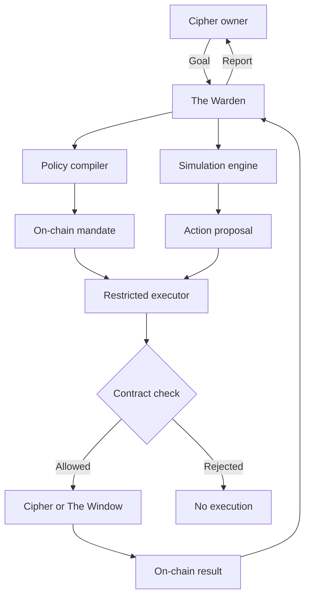

# The Warden

> The Warden is the AI agent for The Veil Syndicate ecosystem.

## Project facts

| Item | Value |
|---|---|
| Agent | The Warden |
| Ecosystem | The Veil Syndicate |
| Network | Robinhood Chain |
| Token | `$VSYNC` |
| Reserve asset | ZEC |
| Main feature | The Window |
| Team | `0xsbcntrl` |
| Contact | X: [@0xsbcntrl](https://x.com/0xsbcntrl), Telegram: [@sbcntrl](https://t.me/sbcntrl) |

## Short description

The Warden helps a Cipher owner read and manage a reserve position.

The owner gives the Warden a goal in plain language. The Warden converts the goal into a limited mandate. The owner signs the mandate. Smart contracts check every action.

The Warden can monitor a Cipher, compare Window choices, prepare transactions, and execute approved actions. The Warden cannot change protocol rules or ignore a mandate.

## The system

An active Cipher has:

- a rank;
- a reserve weight;
- a ZEC cage;
- an open Window balance, if any;
- a history of actions and distributions.

The Window gives an advance from the Cipher's cage. The owner burns `$VSYNC` to use the Window. Future eligible distributions repay the Window first.

## The user problem

A Cipher can have several values and limits. The owner must track:

- activation state;
- rank and weight;
- gross cage value;
- net redeemable value;
- open Window balance;
- reserve utilization;
- `$VSYNC` burn quotes;
- expected distributions;
- transfer and redemption rules.

The Warden gives the owner a clear explanation and a controlled action plan.

## Example mandate

The owner can say:

> Keep at least 70% of my net cage. Open a Window only when the burn is below 8,000 `$VSYNC` and global utilization is below 15%. Use future distributions to repay the Window. Do not transfer or redeem the Cipher.

The Warden can convert this goal to:

```yaml
minimum_net_cage: 70%
maximum_window: 30%
maximum_vsync_burn: 8000
maximum_global_utilization: 15%
distribution_destination: window_repayment
can_transfer: false
can_redeem: false
mandate_expiry: 30 days
```

The smart account checks these values before each action. The AI model cannot change them.

## Authority levels

### Observer

The Warden has read-only access.

It can:

- read the Cipher and reserve;
- calculate Window capacity;
- compare repayment cases;
- send alerts and reports.

It cannot prepare or execute a transaction.

### Copilot

The Warden can prepare a transaction. The owner signs every action.

It can:

- suggest a Window size;
- prepare activation or repayment;
- compare conditions with the mandate;
- warn about reduced reserve flexibility.

### Autopilot

The Warden can execute a small set of approved actions.

Each mandate must define:

- allowed contract functions;
- maximum `$VSYNC` burn per action and period;
- maximum Window share;
- minimum net cage;
- allowed reserve utilization;
- expiry time;
- revocation control.

Transfer, permanent redemption, mandate expansion, and unrestricted token transfer require direct owner approval.

## Main capabilities

### Window planner

The Warden shows several cases:

| Case | Result |
|---|---|
| Conservative | Use 10% of the cage and keep more reserve available. |
| Balanced | Use 20% and send future distributions to repayment. |
| Maximum | Use the full rank limit. |
| Wait | Wait for a lower burn or lower utilization. |

Each case must show:

- ZEC received;
- `$VSYNC` burned;
- gross and net cage after the action;
- estimated repayment time;
- transfer and redemption effects;
- known risks.

### Window automation

Within a mandate, the Warden can:

- wait for approved conditions;
- open a Window;
- increase a Window;
- send distributions to repayment;
- close a Window when the balance allows it;
- stop its own actions when conditions become unsafe.

### Cipher monitor

The Warden reads:

- reserve coverage;
- Window utilization;
- cage obligations;
- distribution history;
- burn quote changes;
- contract pause states;
- mandate expiry;
- transfer and redemption effects.

The interface must explain each result in plain language.

### Transfer report

Before a transfer, the Warden can:

- show open Window obligations;
- calculate net reserve value;
- explain the Veiled state;
- prepare repayment choices;
- create a state report for the new owner;
- revoke its mandate after ownership changes.

### Reserve report

The Warden can create reports with:

- gross and net reserve;
- open Window exposure;
- `$VSYNC` burns by action;
- repayment progress;
- reserve utilization;
- actions taken under each mandate;
- forecast and result comparisons.

Each report must link to on-chain data.

## `$VSYNC` and the Warden

The Warden can add token utility through controlled access.

| Agent action | Token action |
|---|---|
| Activate a mandate | Burn |
| Renew a mandate | Burn |
| Increase execution capacity | Burn |
| Open or increase The Window | Burn through the Window function |
| Request an advanced simulation | Small burn or protocol credit |
| Register an automation policy | Burn |

The agent must not pay rewards through token emissions. Monitoring should remain accessible. Actions with financial effect can require a stronger burn.

## System architecture



The system separates reasoning from authority:

- the model reads intent and compares cases;
- the policy compiler creates limits;
- the owner signs the mandate;
- the executor exposes only approved functions;
- contracts validate each transaction;
- results remain on-chain and auditable.

## Agent-owned Ciphers

In a later phase, an agent can operate its own Cipher under a human or organization constitution.

The Cipher can hold:

- a ZEC cage;
- a `$VSYNC` operating budget;
- a state and rank;
- an open Window balance;
- a signed mandate;
- an action history;
- a reputation record.

The agent can use the Window for approved work. Future distributions can repay the Window. The Cipher becomes a bounded reserve-backed identity for an autonomous economic actor.

## Identity and reputation

The Warden can use an agent identity standard such as [ERC-8004](https://eips.ethereum.org/EIPS/eip-8004).

Reputation can use measurable results:

- mandate compliance;
- successful execution rate;
- avoided policy violations;
- forecast accuracy;
- Window repayment performance;
- response to emergency pauses;
- independent validation results.

Reputation must not increase authority. A trusted agent still follows each signed mandate.

## Security rules

The AI can select an action. Contracts decide if the action is valid.

The Warden must not:

- change Window limits;
- change reserve accounting;
- transfer or redeem a Cipher without approval;
- send funds to an arbitrary address;
- exceed a burn or value cap;
- extend its own mandate;
- change the owner's risk policy;
- bypass a protocol pause;
- hide an action.

The system must use:

- allowlisted contracts and functions;
- value caps per action and period;
- mandate expiry;
- owner revocation;
- simulation before execution;
- transaction receipts and explanations;
- contract validation outside the AI model;
- an emergency pause outside the model;
- separate storage for prompts, policies, and signing authority;
- no private key access for the language model.

## The Warden is not

- a generic crypto chatbot;
- an unrestricted trading bot;
- a price prediction service;
- a yield creator;
- a credit decision maker;
- a replacement for Window solvency rules;
- a privacy layer for public EVM activity;
- an unrestricted wallet custodian.

## Roadmap

### Phase 1: Observer

- Read Cipher and reserve state.
- Answer questions about The Window.
- Compare Window cases.
- Send alerts.
- Execute no transactions.

### Phase 2: Copilot

- Prepare transactions.
- Convert plain-language goals to policies.
- Require owner approval for every action.
- Explain each transaction before and after execution.

### Phase 3: Limited Autopilot

- Use expiring mandates.
- Allow only approved functions.
- Apply burn and value caps.
- Automate Window actions.
- Add immediate revocation.
- Start with low execution limits.

### Phase 4: Autonomous Ciphers

- Add agent identity and reputation.
- Support organization-owned agents.
- Give Ciphers bounded operating budgets.
- Test agent-to-agent actions.
- Add independent action validation.

## Success metrics

Measure:

- active Warden mandates;
- Observer, Copilot, and Autopilot use;
- `$VSYNC` burned by agent actions;
- actions within mandate limits;
- blocked policy violations;
- Window repayment time;
- forecast error;
- mandate revocation rate;
- value under restricted mandates;
- agent-operated Ciphers.

## Open decisions

- one Warden for all Ciphers or one identity per Cipher;
- burn for mandate activation and renewal;
- first Autopilot actions;
- maximum mandate duration;
- burn for advanced simulations;
- smart-account design;
- identity and reputation standard;
- forecast data sources;
- privacy for user instructions;
- legal treatment of automated actions;
- requirements for agent-owned Ciphers.

## Positioning

> Every Cipher can appoint a Warden.

> The Cipher holds the cage. The Warden watches The Window.
