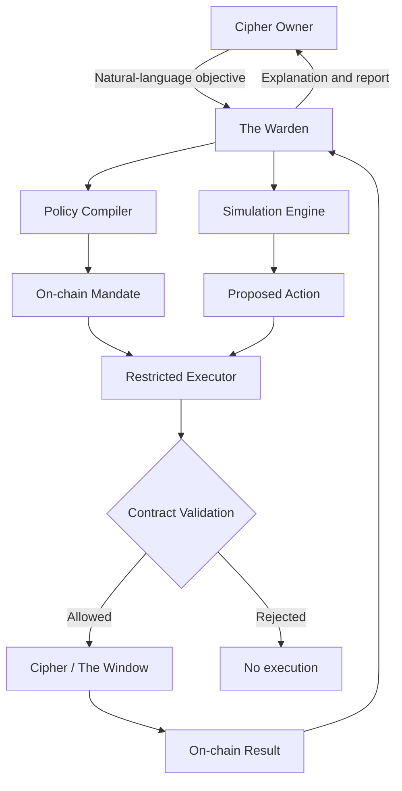

# The Warden

> The native AI agent for The Veil Syndicate ecosystem.

## Project Snapshot

| Field | Detail |
|---|---|
| Agent | The Warden |
| Ecosystem | The Veil Syndicate |
| Category | AI agents, DeFi automation, reserve intelligence |
| Intended network | Robinhood Chain |
| Utility token | `$VSYNC` |
| Reserve asset | ZEC |
| Core primitive | The Window |
| Team | `0xsbcntrl` |
| Contact | X: [@0xsbcntrl](https://x.com/0xsbcntrl) · Telegram: [@sbcntrl](https://t.me/sbcntrl) |
| Stage | Concept design |

## One-Sentence Pitch

The Warden is an AI agent that monitors, simulates, explains, and manages The Window for Cipher owners under explicit, limited, and verifiable on-chain mandates.

## Executive Summary

The Warden is the native AI agent for the ecosystem being built around The Veil Syndicate, `$VSYNC`, Ciphers, the ZEC reserve, and The Window.

Every active Cipher represents a programmable reserve position with an individually accounted ZEC cage. The Window allows its holder to burn `$VSYNC` and access an advance against part of that cage without selling or permanently redeeming the Cipher.

The Warden adds an intelligent management layer to this system. A holder describes a financial objective in natural language, such as maintaining a minimum reserve balance, waiting for a lower `$VSYNC` burn quote, or automatically directing future distributions toward an open Window. The agent converts that objective into a restricted mandate and acts only inside limits enforced by smart contracts.

The Warden does not determine solvency, custody unrestricted funds, change protocol rules, or create credit. Deterministic contracts remain responsible for reserve accounting, Window limits, burns, settlement, and redemption. The agent observes conditions and chooses among actions already permitted by the protocol and the owner.

## The Role of The Warden

The Warden is designed to serve three functions:

1. **Reserve intelligence:** understand the state of a Cipher, its cage, liabilities, distributions, and available Window.
2. **Decision assistance:** simulate possible actions and explain their consequences before execution.
3. **Constrained automation:** execute approved actions within a time-bound and value-capped mandate.

The agent becomes the operating interface between the holder and the financial state of a Cipher.

## The User Problem

As The Veil Syndicate becomes more capable, each Cipher may contain several interacting variables:

- activation state;
- rank and reserve weight;
- gross ZEC cage value;
- net redeemable value;
- open Window balance;
- protocol-wide reserve utilization;
- dynamic `$VSYNC` burn quotes;
- expected future distributions;
- transfer and reactivation conditions.

These variables make the protocol more useful, but they also make each decision harder. A holder must determine when to open a Window, how much reserve to access, how long repayment may take, and whether a transfer or redemption is safe.

The Warden turns this complexity into a conversation and a programmable policy.

## Example Mandate

A holder could tell The Warden:

> Keep at least 70% of my Cipher's net cage available. Open a Window only when the required burn is below 8,000 `$VSYNC` and global reserve utilization is below 15%. Use every future distribution to close the Window. Never transfer or redeem the Cipher.

The agent would translate this instruction into enforceable parameters:

```yaml
minimum_net_cage: 70%
maximum_window: 30%
maximum_vsync_burn: 8,000
maximum_global_utilization: 15%
distribution_destination: window_repayment
can_transfer: false
can_redeem: false
mandate_expiry: 30 days
```

The smart account validates these parameters before every action. The language model cannot override them.

## Autonomy Levels

Cipher owners choose how much authority to delegate.

### Observer

The Warden has read-only access.

It can:

- monitor the Cipher and reserve;
- detect relevant changes;
- calculate the available Window;
- estimate repayment scenarios;
- send alerts and periodic reports.

It cannot prepare or execute transactions.

### Copilot

The Warden can prepare transactions and explain them, but the owner signs every action.

It can:

- recommend a Window size;
- prepare activation or repayment transactions;
- compare current conditions with the owner's policy;
- warn when an action could reduce reserve flexibility.

### Autopilot

The Warden can execute a narrow set of pre-authorized actions.

Its mandate must define:

- permitted contract functions;
- maximum `$VSYNC` burn per action and period;
- maximum Window percentage;
- minimum net cage value;
- acceptable reserve utilization;
- expiration time;
- emergency revocation authority.

Transfer, permanent redemption, mandate expansion, and unrestricted token transfers should always require explicit owner approval.

## Core Capabilities

### Window Planner

The Warden evaluates the Cipher's current state and presents several scenarios:

| Scenario | Example outcome |
|---|---|
| Conservative | Open 10% of the cage and preserve maximum redemption flexibility |
| Balanced | Open 20% and use all future distributions for repayment |
| Maximum permitted | Use the full rank-specific Window limit |
| Wait | Delay execution until the burn quote or utilization falls |

Every scenario should show:

- ZEC received;
- `$VSYNC` burned;
- gross and net cage after execution;
- estimated distributions required to close the Window;
- effect on transfer and redemption;
- relevant protocol risks.

### Window Autopilot

Within an approved mandate, The Warden can:

- wait for predefined market and reserve conditions;
- open a Window;
- increase an existing Window;
- direct distributions toward repayment;
- close a Window when sufficient ZEC becomes available;
- suspend its own actions when protocol conditions deteriorate.

### Cipher Health Monitor

The agent continuously interprets:

- reserve coverage;
- Window utilization;
- individual cage obligations;
- distribution history;
- burn quote changes;
- contract pause states;
- approaching mandate expiration;
- pending transfer or redemption consequences.

The interface produces plain-language explanations rather than a single opaque score.

### Transfer Preparation

Before a Cipher moves to another wallet, The Warden can:

- identify outstanding Window obligations;
- calculate net reserve value;
- explain the Veiled transition;
- prepare repayment options;
- generate a human-readable financial state summary for the recipient;
- revoke its own mandate when ownership changes.

### Reserve Reports

The Warden can generate verifiable reports for a holder or the wider ecosystem:

- current gross and net reserve;
- outstanding Window exposure;
- `$VSYNC` burns by function;
- repayment progress;
- reserve utilization;
- actions executed under each mandate;
- deviations between forecasts and realized outcomes.

Every report should link its conclusions to on-chain state.

## `$VSYNC` Utility for The Warden

The Warden extends `$VSYNC` from protocol access into agent access.

Potential token functions include:

| Agent action | `$VSYNC` function |
|---|---|
| Activate a Warden mandate | Burn |
| Renew an expiring mandate | Burn |
| Increase execution capacity | Burn |
| Open or increase The Window | Burn through the existing Window mechanism |
| Request an advanced simulation | Small burn or protocol-defined access credit |
| Register a verified automation policy | Burn |

The token should not reward the agent through inflationary emissions. `$VSYNC` is consumed when the user requests valuable access, execution, or automation.

The final burn schedule remains `TBD` and must be designed so that ordinary monitoring remains accessible while financially meaningful actions create stronger token demand.

## System Architecture



The architecture separates intelligence from authority:

- the model interprets intent and evaluates scenarios;
- the policy compiler converts intent into structured limits;
- the owner reviews and signs the mandate;
- the executor exposes only approved contract actions;
- protocol contracts independently validate every transaction;
- all results remain auditable on-chain.

## Agent-Owned Ciphers

The longer-term vision allows an autonomous agent to operate its own Cipher under a human- or organization-defined constitution.

An agent-owned Cipher could contain:

- a ZEC cage;
- `$VSYNC` allocated as an operating budget;
- an active or Veiled state;
- rank and reserve weight;
- an open Window balance;
- a signed mandate;
- an on-chain action history;
- a portable reputation record.

The agent could use The Window to access working liquidity, pay for permitted on-chain actions, and close the advance through future distributions. The Cipher would act as the agent's reserve-backed financial identity.

This creates a new participant inside The Veil Syndicate: an autonomous economic actor whose authority, assets, obligations, and reputation are visible and bounded.

## Agent Identity and Reputation

The Warden can be designed for compatibility with emerging agent standards.

[ERC-8004](https://eips.ethereum.org/EIPS/eip-8004) proposes on-chain registries for agent identity, reputation, and validation. A Warden instance could have a registered identity connected to its service endpoints and agent wallet.

Its reputation should be based on measurable outcomes, including:

- adherence to user mandates;
- percentage of successful executions;
- avoided policy violations;
- forecast accuracy;
- Window repayment performance;
- response to emergency pauses;
- independent validation results.

Reputation must never expand the agent's authority automatically. A highly rated agent remains constrained by the mandate signed by each Cipher owner.

## Security Model

The Warden follows the principle that the AI may choose an action, but only contracts determine whether the action is valid.

### Hard Restrictions

The agent must not be able to:

- change protocol-level Window limits;
- alter reserve accounting;
- transfer or permanently redeem a Cipher without explicit approval;
- send funds to arbitrary addresses;
- spend more `$VSYNC` than its mandate permits;
- extend its own mandate;
- change the owner-defined risk policy;
- bypass a protocol pause;
- conceal executed actions.

### Required Controls

- allowlisted contract addresses and functions;
- value caps per action and per period;
- mandate expiration;
- owner revocation at any time;
- simulation before execution;
- transaction receipts and explanations;
- independent smart-contract validation;
- emergency pause controlled outside the model;
- separate storage for prompts, policies, and signing authority;
- no private key exposure to the language model.

## What The Warden Is Not

- It is not a generic crypto chatbot.
- It is not an autonomous trading bot.
- It does not predict or guarantee the price of `$VSYNC` or ZEC.
- It does not create yield.
- It does not decide who deserves credit.
- It does not replace the solvency rules of The Window.
- It does not make public EVM transactions private.
- It does not receive unlimited custody over a user's wallet.

## Differentiation

The Warden combines:

- a native AI agent tied to a reserve protocol;
- natural-language financial mandates;
- deterministic on-chain enforcement;
- a programmable NFT with its own reserve state;
- a ZEC-denominated Window without price-based liquidation;
- automatic repayment from future distributions;
- consumable `$VSYNC` utility;
- support for human-owned and agent-operated Ciphers;
- performance history that can become portable agent reputation.

The AI is useful because it manages changing conditions over time. The contracts remain simple enough to verify because they enforce limits rather than attempting to reproduce the agent's reasoning on-chain.

## Development Roadmap

### Phase 1 — Warden Observer

- read Cipher and reserve state;
- answer questions about The Window;
- produce scenario comparisons;
- notify users of important changes;
- provide no transaction execution.

### Phase 2 — Warden Copilot

- prepare transactions;
- translate natural-language objectives into structured policies;
- require owner approval for every action;
- generate pre- and post-transaction explanations.

### Phase 3 — Limited Autopilot

- deploy expiring mandates;
- introduce allowlisted actions and spending caps;
- automate Window opening and repayment;
- add immediate mandate revocation;
- launch with conservative execution limits.

### Phase 4 — Autonomous Ciphers

- connect agent identity and reputation;
- support organization-owned agents;
- allow Ciphers to hold bounded agent operating budgets;
- test agent-to-agent interactions inside the ecosystem;
- introduce independent action validation.

## Success Metrics

The project should measure useful agent behavior rather than conversation volume:

- active Warden mandates;
- percentage of users choosing Observer, Copilot, and Autopilot;
- `$VSYNC` burned through agent-initiated actions;
- Window actions completed within mandate limits;
- prevented policy violations;
- average Window repayment time;
- forecast error versus realized distributions;
- mandate revocation rate;
- value managed under restricted mandates;
- user retention after closing a Window;
- number of agent-operated Ciphers.

## Open Decisions

- whether one Warden serves all Ciphers or each Cipher receives a distinct agent identity;
- burn requirements for mandate activation and renewal;
- which actions are available in the first Autopilot release;
- maximum mandate duration;
- whether advanced simulations require `$VSYNC` consumption;
- agent wallet and smart-account architecture;
- identity and reputation standard integration;
- data sources permitted for forecasts;
- privacy model for user instructions and portfolio data;
- liability and regulatory treatment of automated financial actions;
- conditions required before agent-owned Ciphers are enabled.

## Short Application Description

The Warden is the AI agent for The Veil Syndicate ecosystem. It helps Cipher owners understand and manage individually accounted ZEC reserve positions and The Window, a protocol primitive that provides liquidity against a Cipher's own cage without market-price liquidations.

Owners define objectives in natural language and authorize the agent through limited, expiring, and value-capped on-chain mandates. The Warden monitors reserve conditions, simulates Window scenarios, prepares transactions, and can execute approved actions through a restricted smart-account interface. Deterministic contracts remain responsible for solvency, reserve accounting, burns, settlement, and redemption.

The Warden adds recurring utility to `$VSYNC`: holders burn the token to activate or renew agent mandates, access controlled automation, and execute Window operations. In its longer-term form, an autonomous agent can operate a Cipher as its own reserve-backed financial identity, with a ZEC cage, `$VSYNC` operating budget, explicit constitution, and verifiable reputation.

## Positioning

> **Every Cipher can appoint a Warden.**

> **The Cipher holds the cage. The Warden watches the Window.**

## Final Thesis

The Veil Syndicate gives every Cipher a reserve, a rank, and a Window. The Warden gives it intelligence.

Together, they create an ecosystem where human and autonomous holders can manage reserve-backed financial positions through transparent contracts, consumable token utility, and explicitly bounded AI authority.
